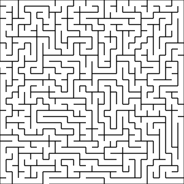

# 🧩 procedural-maze-generator

[](https://www.python.org/)
[](LICENSE)

A simple and customizable maze generator in Python that uses the **recursive backtracking algorithm** (depth-first search). It generates perfect mazes and exports them as SVG or PNG files using a YAML configuration.

---

## 📚 Table of Contents

- Features
- Installation
- Configuration
- Usage
- Example
- License

---

## 🚀 Features

- Customizable maze dimensions (width & height)
- Output in SVG or PNG
- YAML-based configuration
- Clean and minimal codebase
- Easily extendable for other algorithms or formats

---

## 🛠️ Installation

Clone the repository:

```bash
git clone https://github.com/Nilan-Z/procedural-maze-generator.git
cd procedural-maze-generator
```

Install dependencies:

```bash
pip install -r requirements.txt
```

---

## ⚙️ Configuration

Maze generation parameters are defined in the config.yaml file, located at the root of the project:
```yaml
width: 25             # Maze width in cells
height: 25            # Maze height in cells
format: svg           # Output format: 'svg' or 'png'
outputPath: ./output/ # Directory where the maze image will be saved
filename: maze        # Name of the output file (without extension)
```

---

## ▶️ Usage

After configuring config.yaml, run the generator with:

```bash
python generate_maze.py
```

The maze will be saved to the output directory you specified.

---

## 🧾 Example

Here’s a sample generated maze (SVG format):



You can adjust the dimensions and format in config.yaml to generate different types of mazes.

---

## 📄 License

This project is licensed under the [MIT License](LICENSE).
